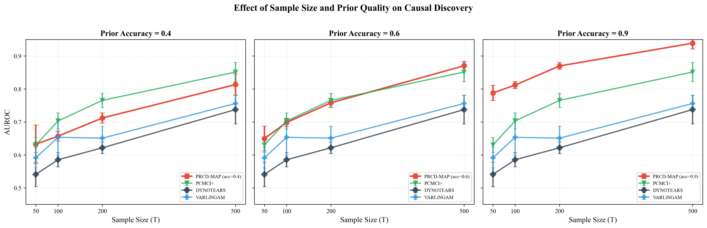

# PRCD-MAP

**Safe Integration of Imperfect Domain Priors for Temporal Causal Discovery**

[](https://opensource.org/licenses/MIT)
[](https://www.python.org/downloads/)
[](https://pytorch.org/)

Paper: *Safe Integration of Imperfect Domain Priors for Temporal Causal Discovery* (under review)

## Key Idea

Temporal causal discovery methods face a brittle trade-off: purely data-driven approaches underperform in low-data regimes, while rigid prior integration amplifies errors when domain knowledge is inaccurate. **PRCD-MAP** resolves this by learning *how much to trust* an imperfect prior from data:

- **Reliable prior** &rarr; large AUROC gains over the best baseline in low-data regimes
- **Mediocre prior** &rarr; graceful fallback to the no-prior regime (marginal degradation)
- **Fixed-trust alternatives** &rarr; collapse under prior misspecification

The core mechanism is **grouped temperature scaling** optimized via empirical Bayes, which automatically attenuates unreliable prior components while sharpening accurate ones.

<p align="center">
  
</p>

## Installation

```bash
git clone https://github.com/AndyShan11/PRCD-MAP.git
cd PRCD-MAP
pip install -r requirements.txt
```

**Optional baselines** (for reproducing comparison results):
```bash
pip install tigramite   # PCMCI+
pip install lingam      # VARLiNGAM
```

## Quick Start

```python
import torch
from prcd_map import PRCD_MAP_Model, run_prcd_map

# Your time series data: (T, d) numpy array
X = ...  # shape (500, 20)

# Prior probability matrix: (d, d), entries in [0, 1]
P_prior = ...  # shape (20, 20)

# Run PRCD-MAP
W0, Wk = run_prcd_map(
    X,
    P_prior=P_prior,
    max_lag=1,
    lambda1=0.001,
    lambda2=0.005,
    n_groups=5,
)
# W0: (d, d) instantaneous causal graph (DAG)
# Wk: (K, d, d) lagged causal matrices
```

## Reproducing Experiments

### All experiments
```bash
bash scripts/run_all.sh
```

### Individual experiments
```bash
bash scripts/run_all.sh exp1      # Synthetic benchmark
bash scripts/run_all.sh exp2      # Real-world benchmarks
bash scripts/run_all.sh exp3      # Ablation study
bash scripts/run_all.sh exp4      # Scalability & hyperparameter sensitivity
bash scripts/run_all.sh figures   # Generate figures
```

**Hardware**: Tested on a single NVIDIA RTX 2080 Ti (11 GB). PRCD-MAP completes d=100 in ~30 seconds.

## Project Structure

```
PRCD-MAP/
├── prcd_map/                    # Core model package
│   ├── __init__.py
│   └── model.py                 # PRCD-MAP model & solver
│
├── experiments/                 # Paper experiment scripts
│   ├── exp_utils.py             # Shared: data gen, baselines, metrics
│   ├── exp1_synthetic.py        # Exp 1: synthetic SVAR benchmark
│   ├── exp2_real.py             # Exp 2: CausalTime & electricity
│   ├── exp3_ablation.py         # Exp 3: ablation study
│   ├── exp4_scalability.py      # Exp 4: scalability & sensitivity
│   └── generate_figures.py      # Paper figures & tables
│
├── data/                        # Data directory (see data/README.md)
├── scripts/
│   └── run_all.sh               # One-click reproduction
├── requirements.txt
└── LICENSE
```

## Method Overview

PRCD-MAP is a MAP-consistent framework with three key components:

1. **Probabilistic prior encoding**: Domain knowledge enters as $P_{\text{prior}} \in [0,1]^{d \times d}$, translated into a prior-modulated $\ell_1$ penalty (edge retention/removal) and a prior-weighted $\ell_2$ regularizer (shrinkage strength).

2. **Empirical Bayes temperature learning**: Per-group temperatures $\tau_g$ are optimized to maximize a Laplace-approximated marginal likelihood, turning "how much to trust the prior" from a manual hyperparameter into a learnable quantity.

3. **Three-level optimization**: Outer augmented Lagrangian (DAG constraint) &rarr; middle EB update ($\tau$) &rarr; inner Adam (structural parameters $W$).

## Citation

If you find this code useful, please cite:

```bibtex
@article{prcdmap2026,
  title={Safe Integration of Imperfect Domain Priors for Temporal Causal Discovery},
  author={Anonymous},
  journal={arXiv preprint},
  year={2026},
  note={Under review}
}
```

## License

This project is licensed under the MIT License - see the [LICENSE](LICENSE) file for details.
